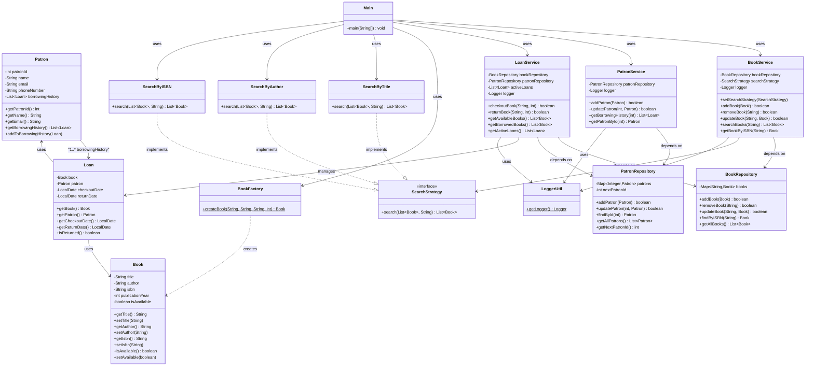

# Library Management System

# 1. Book Management

- Add, remove, and update books in the library inventory
- Search books by title, author, or ISBN
- Track book availability status

# 2. Patron Management

- Add new patrons and update their information
- Track patron borrowing history
- Manage patron records

# 3. Lending Process

- Checkout books to patrons
- Return books from patrons
- Validate availability before checkout

# 4. Inventory Management

- Track available books
- Track borrowed books
- Maintain real-time inventory status

# Project Structure

```
src/main/java/com/library/
├── model/          # Data models (Book, Patron, Loan)
├── repository/     # Data access layer (BookRepository, PatronRepository)
├── service/        # Business logic layer (BookService, PatronService, LoanService)
├── factory/        # Factory pattern (BookFactory)
├── strategy/       # Strategy pattern (SearchStrategy implementations)
├── util/           # Utility classes (LoggerUtil)
└── Main.java       # Entry point and demonstration
```

# Class Diagram

The following diagram illustrates the relationships between all classes in the system:



### Diagram Legend

- **Solid arrows (-->)**: Dependency/Association - one class uses or depends on another
- **Dashed arrows (..>)**: Creation - one class creates instances of another
- **Dashed arrows with | (..|>)**: Implementation - a class implements an interface
- **Attributes**: Private fields are prefixed with `-`, public methods with `+`, static methods with `$`
- **Multiplicity**: `1..*` indicates one-to-many relationship

## Design Principles

### OOP Concepts

- **Encapsulation**: All model classes use private fields with public getters/setters
- **Inheritance**: Strategy pattern uses interface inheritance
- **Polymorphism**: SearchStrategy interface allows different search implementations
- **Abstraction**: SearchStrategy interface abstracts search behavior

### SOLID Principles

- **Single Responsibility**: Each class has one clear purpose
- **Open/Closed**: BookService is open for extension (new search strategies) but closed for modification
- **Liskov Substitution**: All SearchStrategy implementations are interchangeable
- **Interface Segregation**: SearchStrategy interface is focused and minimal
- **Dependency Inversion**: Services depend on abstractions (SearchStrategy interface) not concrete implementations

### Design Patterns

- **Factory Pattern**: `BookFactory` creates Book objects with validation
- **Strategy Pattern**: Different search algorithms (by title, author, ISBN) encapsulated in separate classes

### Java Collections

- `Map<String, Book>` in BookRepository (ISBN as key)
- `Map<Integer, Patron>` in PatronRepository (patronId as key)
- `List<Book>` for search operations
- `List<Loan>` for tracking borrowing history

### Logging

- Uses `java.util.logging` for logging important events
- Logs book operations, patron operations, and lending transactions
- Centralized logging through `LoggerUtil`

## How to Run

1. Compile all Java files:

   ```bash
   javac -d out src/main/java/com/library/**/*.java
   ```

2. Run the Main class:
   ```bash
   java -cp out com.library.Main
   ```

Alternatively, if using an IDE like IntelliJ IDEA or Eclipse:

- Import the project
- Run the `Main.java` file

## Usage Example

```java
// Create repositories
BookRepository bookRepository = new BookRepository();
PatronRepository patronRepository = new PatronRepository();

// Create services
BookService bookService = new BookService(bookRepository);
PatronService patronService = new PatronService(patronRepository);
LoanService loanService = new LoanService(bookRepository, patronRepository);

// Create a book using Factory pattern
Book book = BookFactory.createBook("The Great Gatsby", "F. Scott Fitzgerald", "978-0-7432-7356-5", 1925);
bookService.addBook(book);

// Search by title using Strategy pattern
bookService.setSearchStrategy(new SearchByTitle());
List<Book> results = bookService.searchBooks("Gatsby");

// Create a patron
Patron patron = new Patron(1, "John Doe", "john@email.com", "123-456-7890");
patronService.addPatron(patron);

// Checkout a book
loanService.checkoutBook("978-0-7432-7356-5", 1);

// Return a book
loanService.returnBook("978-0-7432-7356-5", 1);
```
